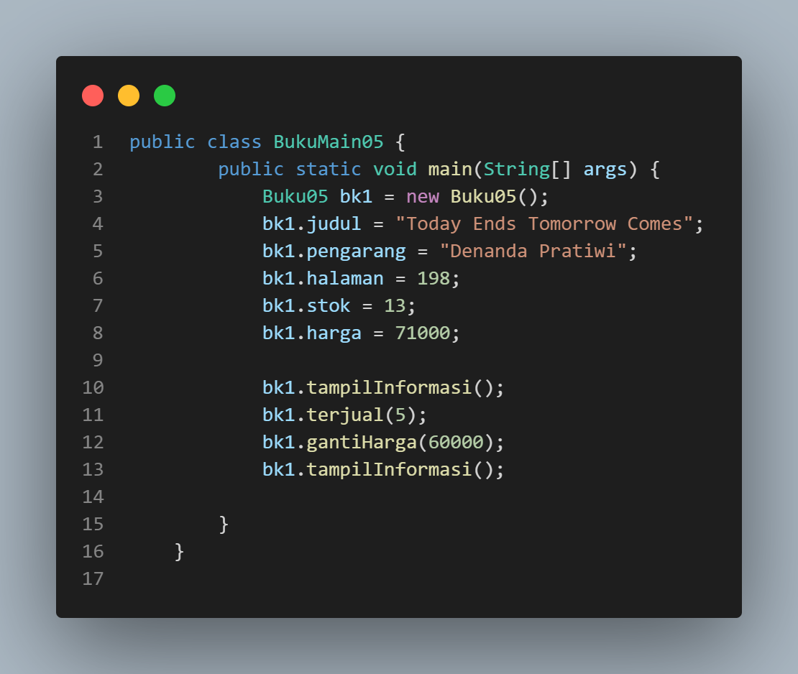
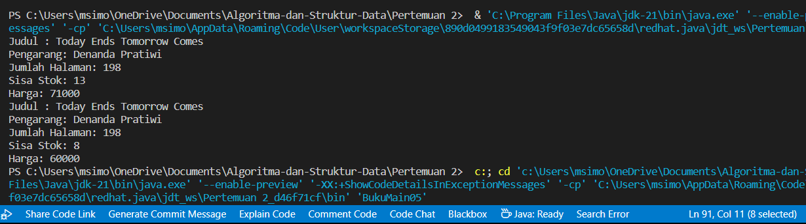
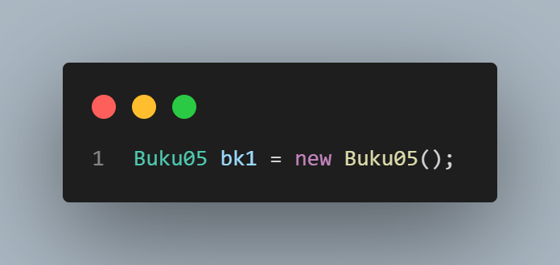
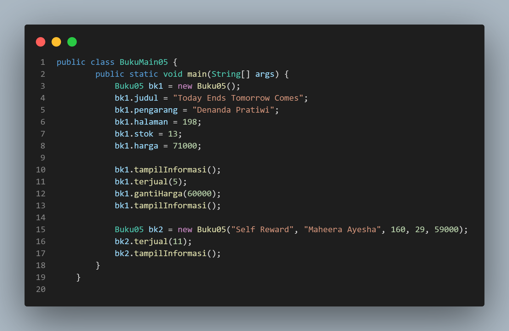
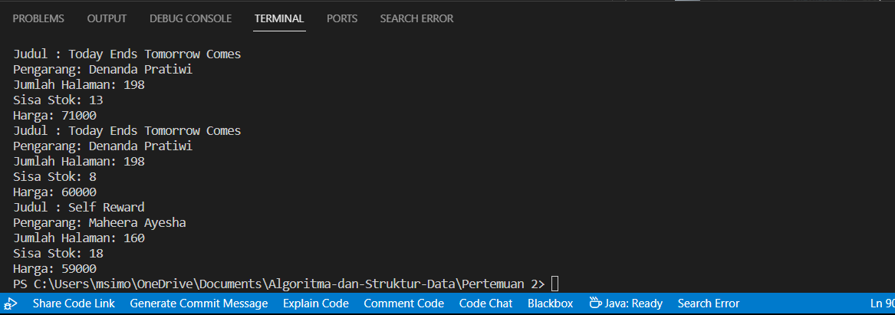
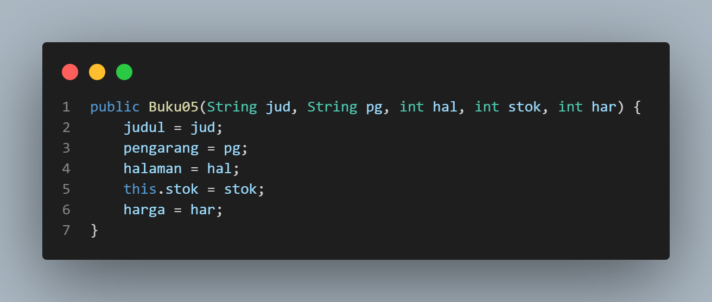
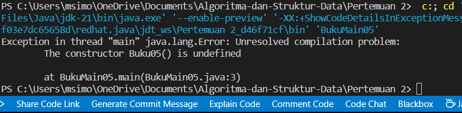
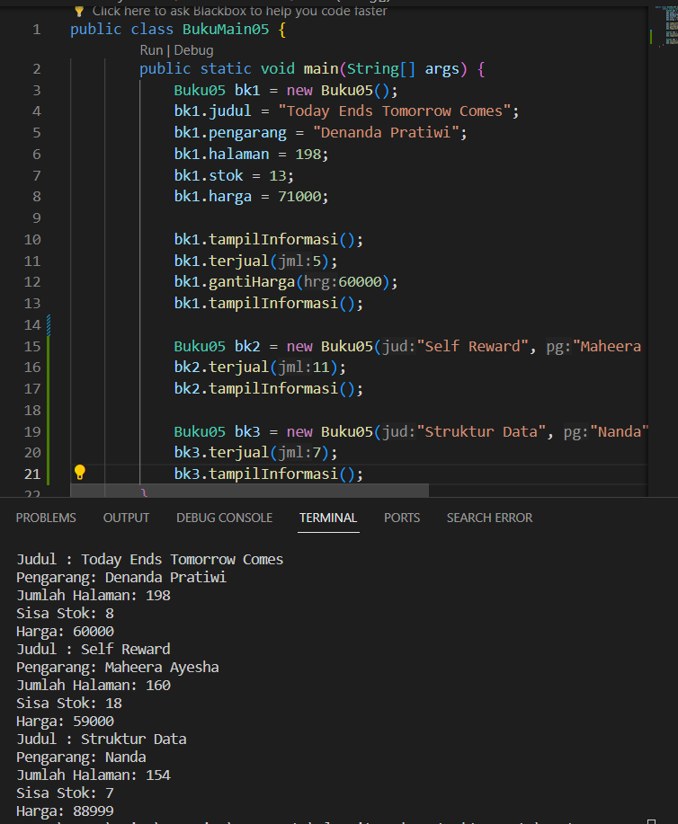
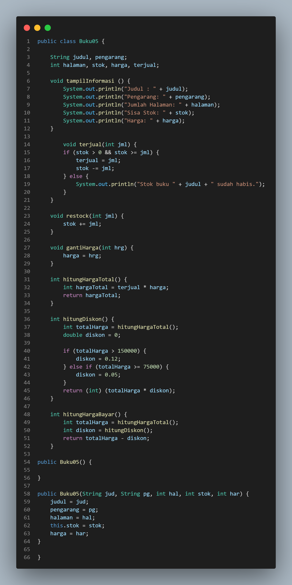
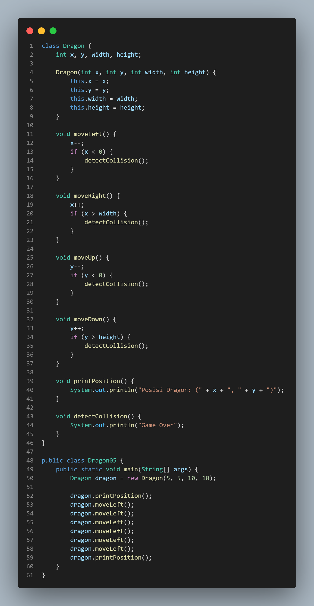

# 
  LAPORAN PRAKTIKUM ALGORITMA DAN STRUKTUR DATA 
 
    

    

     

 Nama : Ananda Satria Putra Nugraha 

 Absen: 05

 NIM  : 2341720132 

 Prodi: TEKNIK INFOMATIKA

 Kelas: 1B 

# Percobaan 1: Deklarasi Class, Atribut dan Method

__Pertanyaan__

1. Sebutkan dua karakteristik class atau object!

Jawab: Encapsulation (Enkapsulasi): Enkapsulasi adalah konsep yang mengacu pada pembungkusan (wrapping) data dan metode (methods) yang bekerja pada data ke dalam satu unit tunggal, yaitu kelas, dan Inheritance (Warisan): Warisan adalah konsep di mana sebuah kelas dapat mewarisi sifat-sifat (data dan metode) dari kelas lain.

2. Perhatikan class Buku pada Praktikum 1 tersebut, ada berapa atribut yang dimiliki oleh class Buku? Sebutkan apa saja atributnya!

Jawab: Terdapat 5 Atribut dalam class Buku antara lain:
- judul (String)
- pengarang (String)
- halaman (int)
- stok (int)
- harga (int)

3. Ada berapa method yang dimiliki oleh class tersebut? Sebutkan apa saja methodnya!

Jawab: Terdapat 4 method dalam class buku antara lain: 
- tampilInformasi()
- terjual()
- restock()
- gantiHarga()

4. Perhatikan method terjual() yang terdapat di dalam class Buku. Modifikasi isi method tersebut
sehingga proses pengurangan hanya dapat dilakukan jika stok masih ada (lebih besar dari 0)!

Jawab: 

5. Menurut Anda, mengapa method restock() mempunyai satu parameter berupa bilangan int?

Jawab: Dengan menggunakan parameter bilangan int, metode ini memiliki fokus yang jelas pada tugasnya, yaitu menambahkan jumlah item yang diberikan ke stok, tanpa memerlukan parameter tambahan yang mungkin tidak relevan dalam konteks ini.

6. Commit dan push kode program ke Github

Jawab: 

# Percobaan 2: Instansiasi Object, serta Mengakses Atribut dan Method

**Percobaan 2**

Verifikasi hasil percobaan 2

**Pertanyaan**

1. Pada class BukuMain, tunjukkan baris kode program yang digunakan untuk proses instansiasi! Apa nama object yang dihasilkan?

Jawab: 
Jadi, object yang dihasilkan dari baris ini adalah `bk1`, yang merupakan instance dari class `Buku05`.

2. Bagaimana cara mengakses atribut dan method dari suatu objek?

Jawab: Dengan menggunakan objek yang diikuti dengan tanda (.) dan  nama atribut / method yang ingin diakses.

3. Mengapa hasil output pemanggilan method tampilInformasi() pertama dan kedua berbeda?

Jawab: Alasan mengapa output dari pemanggilan pertama dan kedua terhadap metode tampilInformasi() berbeda adalah karena cara metode tampilInformasi() didefinisikan dan dipanggil.

# Percobaan 3: Membuat Konstruktor

**Percobaan 3**

Modifikasi pada Buku05

Modifikasi pada BukuMain05

Verifikasi Hasil Modifikasi

**Pertanyaan**

1. Pada class Buku di Percobaan 3, tunjukkan baris kode program yang digunakan untuk mendeklarasikan konstruktor berparameter!

Jawab: 

2. Perhatikan class BukuMain. Apa sebenarnya yang dilakukan pada baris program berikut?

Jawab: Baris kode ini membuat sebuah instance baru dari class Buku dan mengisinya ke variabel `bk2`. Objek tersebut diinisialisasi dengan nilai-nilai spesifik untuk atribut-atributnya: `judul` (“Self Reward”), `penulis` (“Maheera Ayesha”), `jumlah halaman` (160), `stok` (29), dan `harga` (59000)

3. Hapus konstruktor default pada class Buku, kemudian compile dan run program. Bagaimana hasilnya? Jelaskan mengapa hasilnya demikian!

Jawab: 

Hal ini dikarenakan jika konstruktor default dihapus dan tidak ada konstruktor berparameter yang dapat digunakan tanpa memberikan nilai awal, maka mencoba membuat objek tanpa memberikan nilai awal akan menyebabkan kesalahan Compile.

4. Setelah melakukan instansiasi object, apakah method di dalam class Buku harus diakses secara berurutan? Jelaskan alasannya!

Jawab: Tidak, setelah melakukan instansiasi objek dari class Buku, tidak wajib untuk mengakses method di dalam class secara berurutan. Pengaksesan method dalam sebuah class tidak memiliki ketergantungan urutan tertentu, kecuali jika ada aturan logika atau kebutuhan tertentu dalam implementasi dari setiap metode.

5. Buat object baru dengan nama buku<NamaMahasiswa> menggunakan konstruktor
berparameter dari class Buku!

Jawab: 

6. Commit dan push kode program ke Github

Jawab:

# Percobaan Praktikum

1. Latihan Praktikum 1

2. Latihan Praktikum 2

Result
