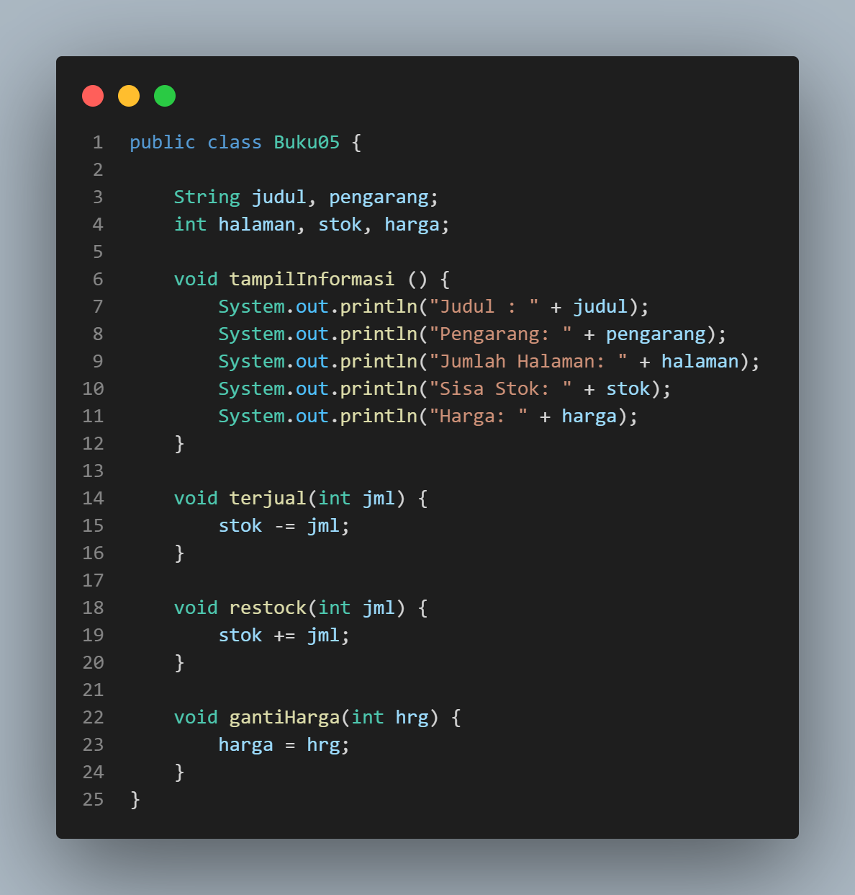

# 
  LAPORAN PRAKTIKUM ALGORITMA DAN STRUKTUR DATA 
 
    

    

     

 Nama : Ananda Satria Putra Nugraha 

 NIM  : 2341720132 

 Prodi: TEKNIK INFOMATIKA

 Kelas: 1B 

# Week 02 - Object

**Percobaan 1: Deklarasi Class, Atribut dan Method**

__Pertanyaan__

1. Sebutkan dua karakteristik class atau object!

Jawab: Encapsulation (Enkapsulasi): Enkapsulasi adalah konsep yang mengacu pada pembungkusan (wrapping) data dan metode (methods) yang bekerja pada data ke dalam satu unit tunggal, yaitu kelas, dan Inheritance (Warisan): Warisan adalah konsep di mana sebuah kelas dapat mewarisi sifat-sifat (data dan metode) dari kelas lain.

2. Perhatikan class Buku pada Praktikum 1 tersebut, ada berapa atribut yang dimiliki oleh class Buku? Sebutkan apa saja atributnya!

Jawab: Terdapat 5 Atribut dalam class Buku antara lain:
- judul (String)
- pengarang (String)
- halaman (int)
- stok (int)
- harga (int)

3. Ada berapa method yang dimiliki oleh class tersebut? Sebutkan apa saja methodnya!

Jawab: Terdapat 4 method dalam class buku antara lain: 
- tampilInformasi()
- terjual()
- restock()
- gantiHarga()

4. Perhatikan method terjual() yang terdapat di dalam class Buku. Modifikasi isi method tersebut
sehingga proses pengurangan hanya dapat dilakukan jika stok masih ada (lebih besar dari 0)!

Jawab: 

5. Menurut Anda, mengapa method restock() mempunyai satu parameter berupa bilangan int?

Jawab: Dengan menggunakan parameter bilangan int, metode ini memiliki fokus yang jelas pada tugasnya, yaitu menambahkan jumlah item yang diberikan ke stok, tanpa memerlukan parameter tambahan yang mungkin tidak relevan dalam konteks ini.

6. Commit dan push kode program ke Github

Jawab: 

