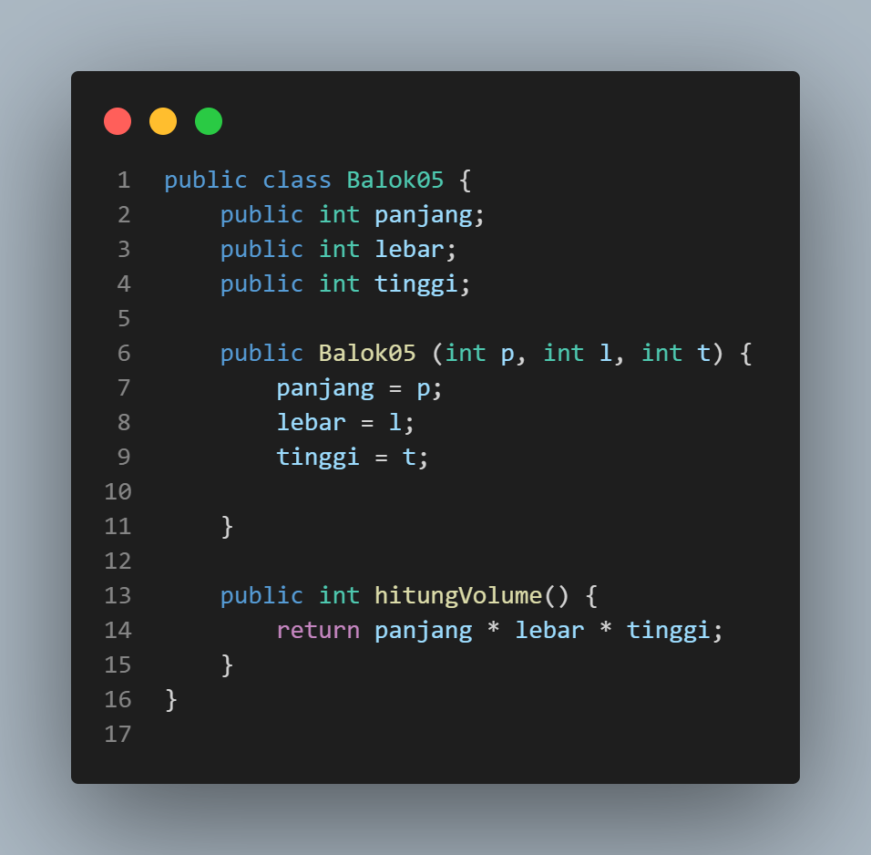
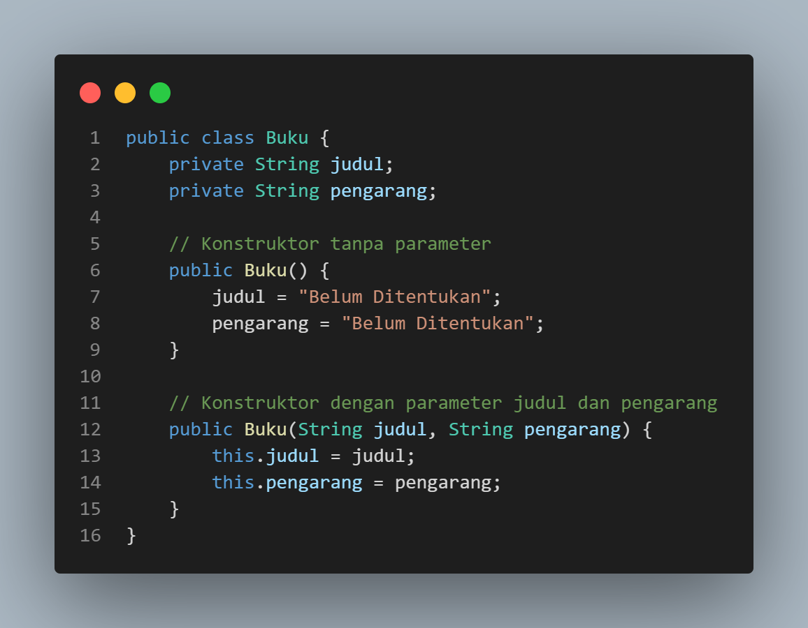

# <p align ="center">  LAPORAN PRAKTIKUM III ALGORITMA DAN STRUKTUR DATA </p> 
<br><br><br><br>

<p align="center">
    </p>

<br><br><br><br><br>


<p align = "center"> Nama : Ananda Satria Putra Nugraha </p>
<p align = "center"> Absen: 05
<p align = "center"> NIM  : 2341720132 </p>
<p align = "center"> Prodi: TEKNIK INFOMATIKA</p>
<p align = "center"> Kelas: 1B </p>

# Percobaan 1: Membuat Array dari Object, Mengisi dan Menampilkan

Kode Program


Hasil  Eksekusi


# Pertanyaan

1. Berdasarkan uji coba 3.2, apakah class yang akan dibuat array of object harus selalu memiliki
atribut dan sekaligus method?Jelaskan!

    Jawab: Tidak, class yang akan dibuat sebagai array of objects tidak selalu harus memiliki atribut dan method secara bersamaan. Hal ini tergantung pada kebutuhan dan desain program yang ingin Anda implementasikan. Beberapa class mungkin hanya memiliki atribut tanpa method, atau sebaliknya, tergantung pada fungsionalitas yang diinginkan.

2. Apakah class PersegiPanjang memiliki konstruktor?Jika tidak, kenapa dilakukan pemanggilan
konstruktur pada baris program berikut :


    Jawab: Tidak, Karena dalam java jika kita tidak memberikan konstruktor dalam class , Java akan secara otomatis membuat konstruktor default tanpa parameter.

3. Apa yang dimaksud dengan kode berikut ini:


    Jawab: Maksud dari baris kode diatas adalah untuk mendeklarasikan dan menginisialisasi sebuah array bernama `ppArray` yang dapat menyimpan objek-objek dari kelas `PersegiPanjang`.

4. Apa yang dimaksud dengan kode berikut ini:


    Jawab: Maksud dari kode diatas adalah untuk membuat objek `PersegiPanjang` baru dan menyimpan objek tersebut dalam array `ppArray` serta mengatur panjang dan lebar objek tersebut menjadi 80 dan 40 secara bururutan.

5. Mengapa class main dan juga class PersegiPanjang dipisahkan pada uji coba 3.2?

    Jawab: Untuk memisahkan entitas yang berbeda ke dalam file atau class yang terpisah, sehingga memudahkan dalam mengelola dan memahami kode. Pemisahan ini juga memungkinkan untuk menggunakan kelas PersegiPanjang di berbagai bagian dari program tanpa perlu menempatkannya di dalam class main.

# Percobaan 2: Menerima Input Isian Array Menggunakan Looping

Kode Program


Output


# Pertanyaan

1. Apakah array of object dapat diimplementasikan pada array 2 Dimensi?

    Jawab: Ya, array of object dapat diimplementasikan pada array 2 dimensi.

2. Jika jawaban soal no satu iya, berikan contohnya! Jika tidak, jelaskan!

    Jawab: 
    
3. Jika diketahui terdapat class Persegi yang memiliki atribut sisi bertipe integer, maka kode
dibawah ini akan memunculkan error saat dijalankan. Mengapa?


    Jawab: Kode ini akan memunculkan error saat dijalankan karena meskipun array `pgArray` telah dibuat dan memiliki ruang untuk 100 objek `Persegi`, objek-objek tersebut belum diinisialisasi. Dengan kata lain, setiap elemen dalam array saat ini adalah `null`.

4. Modifikasi kode program pada praktikum 3.3 agar length array menjadi inputan dengan Scanner!

    Jawab: 
    Output
    

5. Apakah boleh Jika terjadi duplikasi instansiasi array of objek, misalkan saja instansiasi dilakukan
pada ppArray[i] sekaligus ppArray[0]?Jelaskan !

    Jawab: Tidak boleh melakukan duplikasi instansiasi array of objek pada indeks yang sama. Misalnya, tidak boleh melakukan instansiasi pada ppArray[i] dan ppArray[0] karena indeks yang sama dan diisi dua kali dapat menyebabkan kebingungan dan potensi bug dalam program.

# Percobaan 3: Penambahan Operasi Matematika di Dalam Method

Kode Program




Output


# Pertanyaan

1. Dapatkah konstruktor berjumlah lebih dalam satu kelas? Jelaskan dengan contoh!

    Jawab: ya, pada satu class bisa memiliki lebih dari satu konstruktor yang disebut overloading constructor. setiap konstruktor bisa memiliki parameter yang berbeda atau jumlah parameter yang berbeda.
    Contoh: 
    


2. Jika diketahui terdapat class Segitiga seperti berikut ini:
Tambahkan konstruktor pada class Segitiga tersebut yang berisi parameter int a, int t
yang masing-masing digunakan untuk mengisikan atribut alas dan tinggi.


    Jawab: 

3. Tambahkan method hitungLuas() dan hitungKeliling() pada class Segitiga
tersebut. Asumsi segitiga adalah segitiga siku-siku. (Hint: Anda dapat menggunakan bantuan
library Math pada Java untuk mengkalkulasi sisi miring)

    Jawab: 

4. Pada fungsi main, buat array Segitiga sgArray yang berisi 4 elemen, isikan masing-masing
atributnya sebagai berikut:

    sgArray ke-0 alas: 10, tinggi: 4

    sgArray ke-1 alas: 20, tinggi: 10

    sgArray ke-2 alas: 15, tinggi: 6

    sgArray ke-3 alas: 25, tinggi: 10

    Jawab: 

5. Kemudian menggunakan looping, cetak luas dan keliling dengan cara memanggil method
hitungLuas() dan hitungKeliling().

    Jawab: 
    Output
    

# Latihan Praktikum

```
1. Buatlah program yang dapat menghitung luas permukaan dan volume bangun ruang kerucut,
limas segi empat sama sisi, dan bola. Buatlah 3 (tiga) class sesuai dengan jumlah jenis bangun
ruang. Buatlah satu main class untuk membuat array of objects yang menginputkan atribut-atribut yang ada menggunakan konstruktor semua bangun ruang tersebut. Dengan ketentuan,
a. Buat looping untuk menginputkan masing-masing atributnya, kemudian tampilkan
luas permukaan dan volume dari tiap jenis bangun ruang tersebut.
b. Pada kerucut, inputan untuk atribut hanya jari-jari dan sisi miring
c. Pada limas segi empat sama sisi, inputan untuk atribut hanya panjang sisi alas dan
tinggi limas
d. Pada bola, inpuntan untuk atribut hanya jari-jari
```

Jawab: 

**Class Kerucut**

```java
package Latihan1;

public class Kerucut05 {
        double jariJari;
        double sisiMiring;
    
        public Kerucut05(double jariJari, double sisiMiring) {
            this.jariJari = jariJari;
            this.sisiMiring = sisiMiring;
        }
    
        public double hitungLuas() {
            return Math.PI * jariJari * jariJari;
        }
    
        public double hitungVolume() {
            return (1.0 / 3.0) * Math.PI * jariJari * jariJari * sisiMiring;
        }
    }

```

**Class LimasSegiEmpat**

```java
package Latihan1;

public class LimasSegiEmpat05 {
    
    double sisiAlas;
    double tinggi;

    public LimasSegiEmpat05(double sisiAlas, double tinggi) {
        this.sisiAlas = sisiAlas;
        this.tinggi = tinggi;
    }

    public double hitungLuasPermukaan() {
        double luasAlas = sisiAlas * sisiAlas;
        double luasSegitiga = (sisiAlas * tinggi) / 2;
        return luasAlas + 4 * luasSegitiga;
    }

    public double hitungVolume() {
        return (sisiAlas * sisiAlas * tinggi) / 3;
    }
}

```

**Class Bola**

```java
package Latihan1;

public class Bola05 {
    
    double jariJari;

    public Bola05(double jariJari) {
        this.jariJari = jariJari;
    }

    public double hitungLuasPermukaan() {
        return 4 * Math.PI * jariJari * jariJari;
    }

    public double hitungVolume() {
        return (4.0 / 3.0) * Math.PI * jariJari * jariJari * jariJari;
    }
}


```

**Main Class**

```java
package Latihan1;

import java.util.Scanner;

public class ArrayOfObject05 {
    
    public static void main(String[] args) {
        Scanner sc = new Scanner(System.in);

        System.out.print("Masukkan jumlah kerucut: ");
        int jumlahKerucut = sc.nextInt();
        Kerucut05[] kerucutArray = new Kerucut05[jumlahKerucut];

        System.out.print("Masukkan jumlah limas segi empat: ");
        int jumlahLimasSegiEmpat = sc.nextInt();
        LimasSegiEmpat05[] limasSegiEmpatArray = new LimasSegiEmpat05[jumlahLimasSegiEmpat];

        System.out.print("Masukkan jumlah bola: ");
        int jumlahBola = sc.nextInt();
        Bola05[] bolaArray = new Bola05[jumlahBola];

        // Input atribut untuk setiap kerucut
        for (int i = 0; i < jumlahKerucut; i++) {
            System.out.println("Atribut kerucut ke-" + (i + 1));
            System.out.print("Masukkan Jari-Jari: ");
            int jariJari = sc.nextInt();
            System.out.print("Masukkan Sisi Miring: ");
            int sisiMiring = sc.nextInt();
            kerucutArray[i] = new Kerucut05(jariJari, sisiMiring);
            System.out.println();
        }

        // Input atribut untuk setiap limas segi empat
        for (int i = 0; i < jumlahLimasSegiEmpat; i++) {
            System.out.println("Atribut limas segi empat ke-" + (i + 1));
            System.out.print("Masukkan Panjang Sisi Alas: ");
            int panjangSisiAlas = sc.nextInt();
            System.out.print("Masukkan Tinggi: ");
            int tinggi = sc.nextInt();
            limasSegiEmpatArray[i] = new LimasSegiEmpat05(panjangSisiAlas, tinggi);
            System.out.println();
        }

        // Input atribut untuk setiap bola
        for (int i = 0; i < jumlahBola; i++) {
            System.out.println("Atribut bola ke-" + (i + 1));
            System.out.print("Masukkan Jari-Jari: ");
            int jariJariBola = sc.nextInt();
            bolaArray[i] = new Bola05(jariJariBola);
            System.out.println();
        }

        // Output untuk setiap kerucut
        System.out.println("\nHasil Perhitungan Kerucut:");
        for (int i = 0; i < jumlahKerucut; i++) {
            System.out.println("Luas kerucut ke-" + (i + 1) + ": " + kerucutArray[i].hitungLuas());
            System.out.println("Volume kerucut ke-" + (i + 1) + ": " + kerucutArray[i].hitungVolume());
            System.out.println();
        }

        // Output untuk setiap limas segi empat
        System.out.println("\nHasil Perhitungan Limas Segi Empat:");
        for (int i = 0; i < jumlahLimasSegiEmpat; i++) {
            System.out.println(
                    "Luas limas segi empat ke-" + (i + 1) + ": " + limasSegiEmpatArray[i].hitungLuasPermukaan());
            System.out.println("Volume limas segi empat ke-" + (i + 1) + ": " + limasSegiEmpatArray[i].hitungVolume());
            System.out.println();
        }

        // Output untuk setiap bola
        System.out.println("\nHasil Perhitungan Bola:");
        for (int i = 0; i < jumlahBola; i++) {
            System.out.println("Luas bola ke-" + (i + 1) + ": " + bolaArray[i].hitungLuasPermukaan());
            System.out.println("Volume bola ke-" + (i + 1) + ": " + bolaArray[i].hitungVolume());
            System.out.println();
        }
    }
}

```

***Output***<br>


<br>

**Latihan 2**

```
Sebuah kampus membutuhkan program untuk menampilkan informasi mahasiswa berupa nama,
nim, jenis kelamin dan juga IPK mahasiswa. Program dapat menerima input semua informasi
tersebut, kemudian menampilkanya kembali ke user. Implementasikan program tersebut jika
dimisalkan terdapat 3 data mahasiswa yang tersedia. Contoh output program:
```


Jawab: 

**Main Class**

```java
package Latihan2;

import java.util.Scanner;

public class DataMahasiswa05 {
    
        public static void main(String[] args) {
        Scanner sc = new Scanner(System.in);

        Mahasiswa05[] mhs = new Mahasiswa05[3];

        for (int i = 0; i < 3; i++) {
            System.out.println("Masukkan data mahasiswa ke-" + (i + 1));
            System.out.print("Masukkan nama: ");
            String nama = sc.nextLine();
            System.out.print("Masukkan NIM: ");
            String nim = sc.nextLine();
            System.out.print("Masukkan Jenis Kelamin: ");
            String jenisKelamin = sc.nextLine();
            System.out.print("Masukkan IPK: ");
            double ipk = sc.nextDouble();
            sc.nextLine();

            mhs[i] = new Mahasiswa05(nama, nim, jenisKelamin, ipk);
        }
        System.out.println();

        // Menampilkan informasi mahasiswa yang telah diinputkan
        for (int i = 0; i < 3; i++) {
            System.out.println("Data Mahasiswa ke-" + (i + 1));
            System.out.println("Nama: " + mhs[i].nama);
            System.out.println("NIM: " + mhs[i].nim);
            System.out.println("Jenis Kelamin: " + mhs[i].jenisKelamin);
            System.out.println("IPK: " + mhs[i].ipk);
        }
    }

}

```

**Class Mahasiswa**

```java
package Latihan2;

public class Mahasiswa05 {
    
    public String nama, nim, jenisKelamin;
    public double ipk;

    public Mahasiswa05(String nama, String nim, String jenisKelamin, double ipk) {
        this.nama = nama;
        this.nim = nim;
        this.jenisKelamin = jenisKelamin;
        this.ipk = ipk;
    }
}

```

***Output***


**Latihan 3**

```
Modifikasi program Latihan no.2 di atas, sehingga bisa digunakan untuk menghitung rata-rata IPK, serta menampilkan data mahasiswa dengan IPK terbesar! (gunakan method untuk masing-masing proses tersebut)
```

**Jawab**

**Main Class**

```java
package Latihan2;

import java.util.Scanner;

public class DataMahasiswa05 {
    
        public static void main(String[] args) {
        Scanner sc = new Scanner(System.in);

        Mahasiswa05[] mhs = new Mahasiswa05[3];

        for (int i = 0; i < 3; i++) {
            System.out.println("Masukkan data mahasiswa ke-" + (i + 1));
            System.out.print("Masukkan nama: ");
            String nama = sc.nextLine();
            System.out.print("Masukkan NIM: ");
            String nim = sc.nextLine();
            System.out.print("Masukkan Jenis Kelamin: ");
            String jenisKelamin = sc.nextLine();
            System.out.print("Masukkan IPK: ");
            double ipk = sc.nextDouble();
            sc.nextLine();

            mhs[i] = new Mahasiswa05(nama, nim, jenisKelamin, ipk);
        }
        System.out.println();

        for (int i = 0; i < 3; i++) {
            System.out.println("Data Mahasiswa ke-" + (i + 1));
            System.out.println("Nama: " + mhs[i].nama);
            System.out.println("NIM: " + mhs[i].nim);
            System.out.println("Jenis Kelamin: " + mhs[i].jenisKelamin);
            System.out.println("IPK: " + mhs[i].ipk);
        }

        System.out.println();
        double rataIPK = Mahasiswa05.hitungRataIPK(mhs);
        System.out.println("Rata-rata IPK: " + rataIPK);
        System.out.println();

        Mahasiswa05 terbaik = Mahasiswa05.mahasiswaTerbaik(mhs);
        System.out.println("Mahasiswa dengan IPK terbesar:");
        System.out.println("Nama: " + terbaik.nama);
        System.out.println("NIM: " + terbaik.nim);
        System.out.println("Jenis Kelamin: " + terbaik.jenisKelamin);
        System.out.println("IPK: " + terbaik.ipk);

    }

}

```

**Class Mahasiswa**

```java
package Latihan2;

public class Mahasiswa05 {
    
    public String nama, nim, jenisKelamin;
    public double ipk;

    public Mahasiswa05(String nama, String nim, String jenisKelamin, double ipk) {
        this.nama = nama;
        this.nim = nim;
        this.jenisKelamin = jenisKelamin;
        this.ipk = ipk;
    }

    public static double hitungRataIPK(Mahasiswa05[] mhs) {
        double totalIPK = 0;
        for (Mahasiswa05 mahasiswa : mhs) {
            totalIPK += mahasiswa.ipk;
        }
        return totalIPK / mhs.length;
    }

    public static Mahasiswa05 mahasiswaTerbaik(Mahasiswa05[] mhs) {
        Mahasiswa05 terbaik = mhs[0];
        for (Mahasiswa05 mahasiswa : mhs) {
            if (mahasiswa.ipk > terbaik.ipk) {
                terbaik = mahasiswa;
            }
        }
        return terbaik;
    }
}

```

***Output***

